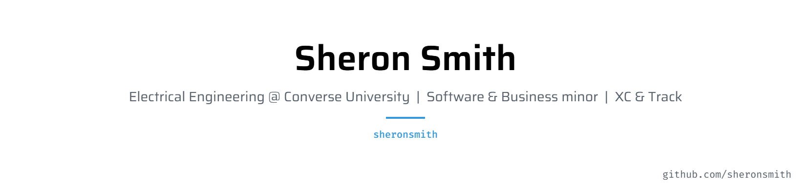

<picture>
   <source media="(prefers-color-scheme: dark)" srcset="art/header-dark.png">
   
</picture>

## 👋 Hey, I'm Sheron

I'm a freshman at **Converse University** majoring in **Electrical Engineering**, with minors in **Business** and **Software Engineering**. When I'm not in class or writing code, I'm running **cross country and track**.

I like building tools that solve real problems for the people around me, from Discord bots to apps for my team.

 

## 🛠️ What I work with

  
  
  
  
  
  
  
  

 

## 🚀 What I'm up to

- 📚 Learning circuits, programming, and how businesses actually run
- 🤖 Building bots that help people on social media
- 🏃 Training for the next cross country and track season
- 🌱 Always learning something new

 

## 🏃 Featured project

**Track Tracker** is a race log for runners. Add your meets and it shows your PRs, charts your progress, and does the pace math. Built with plain JavaScript and Chart.js. [Try the live demo](https://sheronsmith.github.io/track-tracker/?demo).

 

## 📊 GitHub Stats

  
  

 

## 📫 Reach me

  
  
  

 

<i>"Student of my craft, I'm always learning."</i>

